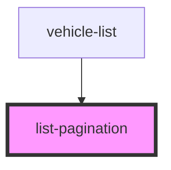

# list-pagination

<!-- Auto Generated Below -->

## Properties

| Property       | Attribute        | Description                                         | Type     | Default     |
| -------------- | ---------------- | --------------------------------------------------- | -------- | ----------- |
| `count`        | `count`          | The count of all items in the list.                 | `number` | `undefined` |
| `itemsPerPage` | `items-per-page` | How many items per page shall be shown on the list? | `number` | `undefined` |
| `offset`       | `offset`         | The current offset of the list.                     | `number` | `undefined` |

## Events

| Event    | Description                        | Type                               |
| -------- | ---------------------------------- | ---------------------------------- |
| `paging` | Emits, when a paging is triggered. | `CustomEvent<{ offset: number; }>` |

## Dependencies

### Used by

 - [vehicle-list](../vehicle-list)

### Graph

----------------------------------------------

*Built with [StencilJS](https://stenciljs.com/)*
