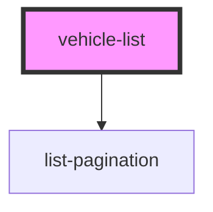

# vehicle-list

<!-- Auto Generated Below -->

## Properties

| Property    | Attribute    | Description                     | Type     | Default          |
| ----------- | ------------ | ------------------------------- | -------- | ---------------- |
| `listTitle` | `list-title` | The title of this Vehicle List. | `string` | `'Vehicle List'` |

## Dependencies

### Depends on

- [list-pagination](../list-pagination)

### Graph

----------------------------------------------

*Built with [StencilJS](https://stenciljs.com/)*
